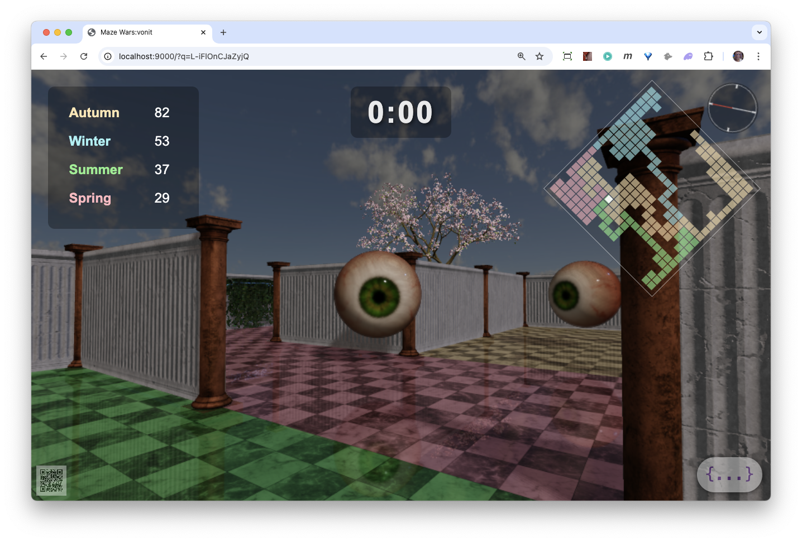

# Labyrinth of Seasons
## A Multiplayer Strategy/Shooter

## The Rules of the Labyrinth:

- There are up to four players within the Labyrinth, each representing a season.
- You start in your season’s corner.
- First to control 100 cells or hold the largest number of cells at the end.
- You respawn in your corner when shot.
You cannot be harmed while in your season’s corner.
- You can only shoot someone when you are on your own cells.
- You move much faster when you are moving on your cells.
- Your cells must be contiguous and connected to the season tree in your corner. If they are cut off from that, the disconnected cells die. 
- Cells are connected even though they may be on either side of a wall.

The winning map is used to generate an NFT which is then presented to the winning player. That NFT includes the final winning color pattern as well as the data for the labyrinth map. It is automatically minted and presented to the player if they have a wallet connected to the browser.

Players are ranked by number of wins - which is the number of NFTs.
